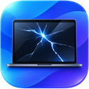

# Broken Screen for Mac

<p align="center">
  
</p>

> Broken screen doesn't mean broken dreams.

Broken Screen for Mac is a focused utility for MacBooks with damaged, unwanted, or permanently dark internal displays. Turn it on once and macOS stops treating the built-in panel as usable desktop space whenever an external monitor is connected—even when the lid opens.

No lost windows. No wandering pointer. No complicated display-control dashboard.

## What it does

- Keeps the built-in display disconnected while a confirmed physical external display is active.
- Preserves virtual displays without treating them as a physical safety monitor.
- Reapplies the setting when the lid opens or the Mac wakes.
- Restores the built-in display if the last external display disappears.
- Restores normal behavior when Broken Screen is turned off or quits.
- Remembers whether Broken Screen was enabled.
- Lives in the menu bar and hides its window instead of quitting when closed.
- Can launch quietly at login.
- Runs an independent watchdog that restores the internal display if the app crashes.
- Runs locally without an account, analytics, or cloud service.

## Who it is for

- MacBooks with broken display panels, flex cables, or hinges.
- Desk setups where the internal screen should stay out of the desktop layout.
- People who want one obvious switch instead of a full display-management suite.

## Current status

Broken Screen is an early macOS prototype. It has been tested on Apple silicon running macOS Tahoe 26 with directly connected external displays. Broader hardware, dock, DisplayLink, sleep/wake, and failure-recovery testing is still required before a public release.

Version 0.2 classifies displays as built-in, physical, virtual, or unknown. Only a confirmed physical external display can authorize disconnecting the internal panel; virtual and unknown displays are ignored by the safety engine. Wider testing with BetterDisplay, Sidecar, AirPlay, DisplayLink, and different docks is still in progress.

After protection has started with a physical monitor present, an active Screen Sharing, virtual, or software-backed DisplayLink display can preserve the current protected state. These displays cannot initiate protection by themselves, but their connection must not force a display restore or rearrange the desktop.

The app uses an undocumented macOS display-configuration function because Apple does not provide a public API for soft-disconnecting the built-in display. That makes Broken Screen unsuitable for the Mac App Store and means future macOS releases may require compatibility updates.

The [safety model](docs/safety-model.md) documents the invariants, recovery layers, trust boundaries, and known limitations. The [architecture](docs/architecture.md) explains how the Tauri UI, Rust engine, Core Graphics boundary, persistence, and watchdog fit together.

Broken Screen cannot make damaged display wiring electrically safe. If moving the hinge causes heat, smells, shutdowns, or other electrical symptoms, stop using the hinge and have the Mac serviced.

## Development

Prerequisites:

- macOS
- Apple Command Line Tools
- Rust stable
- Node.js and npm

```sh
npm install
npm run tauri dev
```

Production checks:

```sh
npm run build
npm run check
npm test
```

## How it works

The Tauri frontend provides the small control surface. The Rust backend uses Core Graphics display state plus macOS display metadata to distinguish physical and virtual devices. When Broken Screen is enabled and a confirmed physical external display exists, it applies an app-scoped display configuration through the private `CGSConfigureDisplayEnabled`/`SLSConfigureDisplayEnabled` function available in macOS.

Safety rules are part of the product, not optional extras:

1. Do not disconnect the internal display without an active, confirmed physical external display.
2. Restore the internal display when external displays disappear.
3. Restore it when automation is disabled or the app exits.
4. Keep switching app-scoped so WindowServer can unwind it when the process ends.
5. Start an independent recovery process before disconnecting the internal display.

The launch-at-login setting points to the installed app. During development, leave it off unless you intentionally want the debug build to start when you sign in.

## Verification

`npm run verify` builds the frontend, type-checks TypeScript, checks the Rust application, and runs the safety-policy unit tests. GitHub Actions repeats those checks on macOS for every push and pull request.

## Roadmap

- Signed and notarized distribution
- Broader classification testing for BetterDisplay, AirPlay, Sidecar, DisplayLink, and docks
- Event-driven hot-plug and wake handling
- Automated tests across Apple silicon models, docks, and macOS versions
- Accessible onboarding and recovery instructions

## Brand

Broken Screen for Mac is made by **Search & Be Found**.

## License

Broken Screen for Mac is available under the [MIT License](LICENSE).
