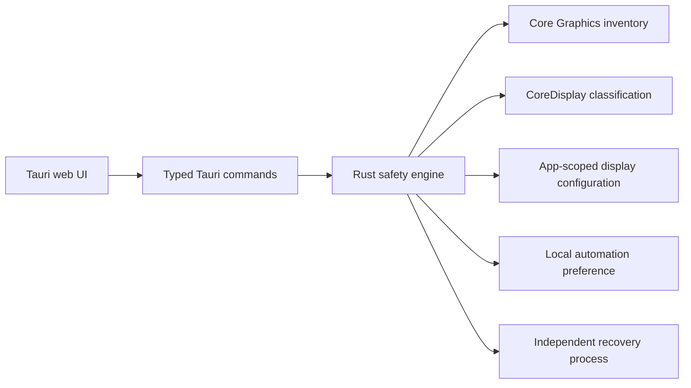

# Architecture

Broken Screen separates the control surface from the display safety engine.

## Control surface

The TypeScript frontend renders reported display state and invokes a small command boundary. It does not decide whether a display can be disconnected.

## Safety engine

Rust owns classification, reconciliation, persistence, and restoration. Protection can begin only when an active, online, confirmed physical external display exists. Virtual and unknown displays cannot authorize the initial topology change.

## Recovery

Display changes use app scope so WindowServer can unwind them on process loss. Before disabling the internal panel, the engine starts a separate watchdog that restores it if the parent process disappears. Normal shutdown and automation disable also restore managed state.

## Platform boundary

The engine dynamically resolves the private macOS symbol rather than assuming availability. Unsupported platforms and systems without the symbol fail closed. No display-changing implementation is compiled for non-macOS targets.
